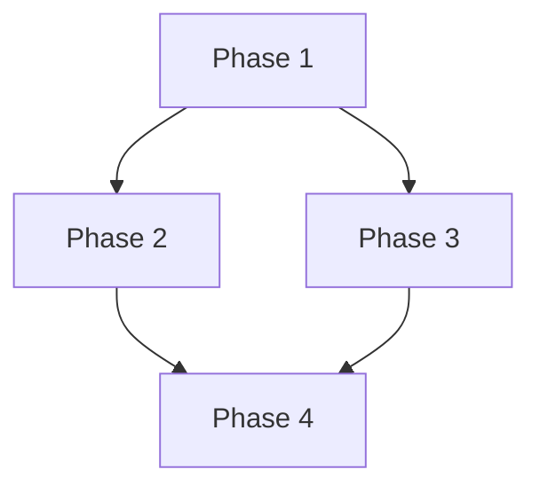

# Planning Engine

> **Module**: Core  
> **Version**: 1.0.0  
> **Status**: Active

---

## Purpose

The Planning Engine transforms ambiguous goals into concrete, executable plans. It decomposes complex tasks into ordered steps, identifies dependencies, allocates resources (agents/skills), estimates effort, and produces actionable implementation plans that any agent in the system can execute.

Great execution without a plan is luck. Great planning without execution is waste. The Planning Engine ensures both work together.

---

## Responsibilities

1. **Goal Decomposition** — Break high-level objectives into hierarchical task trees with clear deliverables at each level.

2. **Dependency Analysis** — Map dependencies between tasks. Identify critical paths, parallelizable work, and blocking dependencies.

3. **Resource Allocation** — Assign the right agents and skills to each task based on expertise matching and availability.

4. **Effort Estimation** — Provide time and complexity estimates for each task and the overall plan.

5. **Risk Assessment** — Identify potential failure points, unknowns, and contingency plans for each risk.

6. **Plan Optimization** — Minimize total execution time by maximizing parallelism while respecting dependency constraints.

7. **Plan Adaptation** — Revise plans when reality diverges from expectations. Replan dynamically without losing progress.

---

## Invocation Rules

| Condition | Action |
|---|---|
| Complex task received (>3 steps estimated) | Generate full implementation plan |
| User requests a feature or system | Produce task breakdown before coding |
| Multiple agents need coordination | Create orchestration plan |
| Significant deviation from plan detected | Trigger replanning |
| User says "plan", "design", or "architect" | Activate Planning Engine |
| Ambiguous requirements detected | Plan includes clarification phase |

---

## Inputs

| Input | Type | Description |
|---|---|---|
| `goal` | String | High-level objective to accomplish |
| `constraints` | Array | Time, budget, technology, or scope constraints |
| `context` | Object | Current project state from Context Manager |
| `available_agents` | Array | Agents available for task assignment |
| `available_skills` | Array | Skills available for task execution |
| `history` | Array | Past plans and their outcomes from Memory Manager |
| `priority` | Enum | `critical`, `high`, `medium`, `low` |

---

## Outputs

| Output | Type | Description |
|---|---|---|
| `plan` | Object | Structured implementation plan with phases and tasks |
| `task_tree` | Object | Hierarchical decomposition of all tasks |
| `dependency_graph` | Object | Mermaid diagram of task dependencies |
| `timeline` | Object | Estimated timeline with milestones |
| `risk_register` | Array | Identified risks with mitigation strategies |
| `resource_map` | Object | Agent/skill assignments per task |

---

## Plan Structure

```markdown
# Implementation Plan: [Goal]

## Overview
Brief description and success criteria.

## Phases

### Phase 1: [Name]
**Duration**: Estimated time
**Dependencies**: None (starting phase)
**Assigned To**: [Agent(s)]

#### Tasks
- [ ] Task 1.1: Description
  - Input: What's needed
  - Output: What's produced
  - Skill: Referenced skill
  - Risk: Known risks
  
- [ ] Task 1.2: Description
  ...

### Phase 2: [Name]
**Dependencies**: Phase 1
...

## Dependency Graph


## Risk Register
| Risk | Probability | Impact | Mitigation |
|---|---|---|---|
| ... | ... | ... | ... |

## Success Criteria
- [ ] Criterion 1
- [ ] Criterion 2
```

---

## Example Usage

### Scenario: Planning a SaaS MVP

```
Goal: "Build an MVP for a task management SaaS"

Planning Engine produces:

Phase 1: Discovery & Design (2 days)
├── Task 1.1: Define user personas → Product Manager
├── Task 1.2: Competitive analysis → Customer Discovery Expert
├── Task 1.3: Write PRD → Product Manager + PRD Template
├── Task 1.4: Design system architecture → Software Architect
└── Task 1.5: Create UI wireframes → UI Designer

Phase 2: Foundation (3 days)
├── Task 2.1: Set up monorepo → DevOps Engineer
├── Task 2.2: Database schema design → Backend Engineer
├── Task 2.3: API contract definition → Backend Engineer
├── Task 2.4: Design system setup → Frontend Engineer
└── Task 2.5: Auth system → Backend + Security Engineer

Phase 3: Core Features (5 days)
├── Task 3.1: Task CRUD API → Backend Engineer
├── Task 3.2: Task UI components → Frontend Engineer
├── Task 3.3: Real-time updates → Backend + Frontend
├── Task 3.4: User management → Backend Engineer
└── Task 3.5: Dashboard → Frontend Engineer

Phase 4: Polish & Deploy (2 days)
├── Task 4.1: Testing → QA Engineer
├── Task 4.2: Performance optimization → Principal Engineer
├── Task 4.3: Security audit → Security Engineer
├── Task 4.4: CI/CD pipeline → DevOps Engineer
└── Task 4.5: Documentation → Documentation Generator

Dependencies:
Phase 1 → Phase 2 → Phase 3 → Phase 4
Tasks within phases can parallelize where noted.
```

---

## Best Practices

1. **Start with the end state.** Define what "done" looks like before decomposing the path to get there. Work backward from success criteria to tasks.

2. **Keep tasks atomic.** Each task should have one clear deliverable. If a task description contains "and," it should probably be two tasks.

3. **Identify the critical path.** The longest chain of dependent tasks determines the minimum project duration. Optimize this chain first.

4. **Build in slack for unknowns.** Add 20-30% buffer to estimates for tasks involving new technologies, integrations, or unclear requirements.

5. **Plan for replanning.** Include checkpoint milestones where the plan is reviewed and adjusted. No plan survives first contact with reality unchanged.

6. **Make plans visual.** Always include Mermaid dependency graphs. A picture of the plan is worth a thousand bullet points.

7. **Reference past plans.** Check Memory Manager for similar past projects. Reuse plan structures that worked. Learn from plans that failed.

8. **Separate must-haves from nice-to-haves.** Use MoSCoW prioritization (Must, Should, Could, Won't) to scope each phase.

---

## Integration Points

| Module | Interaction |
|---|---|
| Context Manager | Provides project state for informed planning |
| Memory Manager | Retrieves past plans and outcomes |
| Task Orchestrator | Executes the plan by dispatching tasks to agents |
| Decision Engine | Resolves decision points within the plan |
| Reflection Engine | Reviews plan quality and completeness |
| Token Optimizer | Ensures plans are token-efficient for agent consumption |
