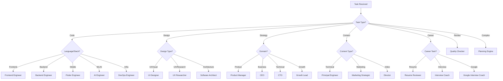

# Task Orchestrator

> **Module**: Core  
> **Version**: 1.0.0  
> **Status**: Active

---

## Purpose

The Task Orchestrator is the central dispatcher of Thoth OS. It receives tasks, determines which agents and skills are needed, manages execution order based on dependencies, handles multi-agent coordination, and ensures tasks are completed efficiently with proper handoffs between agents.

Without orchestration, agents work in isolation. With orchestration, they work as a team. The Task Orchestrator transforms a collection of agents into a coordinated system.

---

## Responsibilities

1. **Task Routing** — Match incoming tasks to the most appropriate agent(s) and skill(s) based on expertise, task type, and availability.

2. **Dependency Management** — Identify task dependencies, sequence dependent tasks, and parallelize independent ones.

3. **Multi-Agent Coordination** — Orchestrate tasks that require multiple agents. Manage handoffs, shared context, and conflict resolution.

4. **Progress Tracking** — Monitor task execution status, identify blockers, and report progress.

5. **Error Recovery** — Handle task failures with retry logic, fallback strategies, and escalation procedures.

6. **Load Balancing** — Distribute work efficiently when multiple tasks compete for the same agent.

7. **Pipeline Management** — Execute predefined workflows (startup, hackathon, deployment) as coordinated pipelines.

---

## Invocation Rules

| Condition | Action |
|---|---|
| User submits a task or command | Route to appropriate agent(s) |
| Task requires multiple agents | Create orchestration plan |
| Workflow command is invoked | Execute workflow pipeline |
| Task fails | Initiate error recovery |
| Agent produces output needing review | Route to Quality Checker or next agent |
| Parallel tasks complete | Merge results and continue pipeline |
| Blocked task detected | Identify and resolve blocker |

---

## Inputs

| Input | Type | Description |
|---|---|---|
| `task` | Object | Task description, requirements, and constraints |
| `priority` | Enum | `critical`, `high`, `medium`, `low` |
| `workflow` | String | Optional workflow to follow |
| `agents` | Array | Specific agents to involve (if user-specified) |
| `deadline` | Date | Optional deadline for time-sensitive tasks |
| `context` | Object | Relevant context from Context Manager |

---

## Outputs

| Output | Type | Description |
|---|---|---|
| `execution_plan` | Object | Ordered list of agent-task assignments |
| `status` | Object | Current status of all active tasks |
| `results` | Array | Completed task outputs |
| `handoff_package` | Object | Context package for agent-to-agent handoffs |
| `progress_report` | Object | Completion percentage and remaining work |

---

## Routing Logic



---

## Multi-Agent Orchestration Patterns

### Sequential Pipeline
```
Agent A → Output → Agent B → Output → Agent C → Final Output

Example: Feature Development
  Product Manager (PRD) → Software Architect (Design) → 
  Backend Engineer (API) → Frontend Engineer (UI) → 
  QA Engineer (Tests) → DevOps Engineer (Deploy)
```

### Parallel Fan-Out / Fan-In
```
            ┌→ Agent B → Output B ─┐
Agent A → ─ ┤                      ├→ Merge → Agent D
            └→ Agent C → Output C ─┘

Example: Security Audit
  Security Engineer → Fan Out:
    ├→ Code Review (secure coding check)
    ├→ Dependency Audit (vulnerability scan)
    └→ Config Review (hardening check)
  → Merge → Security Report
```

### Review Loop
```
Agent A → Output → Reviewer → Pass? → Deliver
                      ↓ Fail
                   Agent A (revise)

Example: Content Creation
  Script Writer → Draft → Director (review) → 
    Pass? → Final → Fail? → Script Writer (revise)
```

---

## Example Usage

### Scenario: User invokes `/build` command

```
1. Task Orchestrator receives: /build "REST API for task management"

2. Orchestration Plan:
   Phase 1 (parallel):
     - Product Manager: Generate brief PRD
     - Software Architect: Design API architecture
   
   Phase 2 (sequential, depends on Phase 1):
     - Backend Engineer: Implement API endpoints
   
   Phase 3 (parallel, depends on Phase 2):
     - QA Engineer: Write tests
     - Security Engineer: Security review
   
   Phase 4 (sequential, depends on Phase 3):
     - Documentation Generator: API documentation
     - DevOps Engineer: Deployment configuration

3. Execution:
   - Phase 1 agents receive context from Context Manager
   - Outputs are quality-checked before handoff
   - Phase 2 receives merged outputs from Phase 1
   - Progress tracked and reported at each phase
   
4. Delivery:
   - All outputs merged into final deliverable
   - Quality Checker runs final gate
   - Result delivered to user
```

### Scenario: Error recovery during execution

```
1. Backend Engineer fails on database connection setup
2. Task Orchestrator detects failure
3. Recovery strategy:
   a. Check error type: Configuration issue
   b. Route to DevOps Engineer for config fix
   c. Retry Backend Engineer task with fixed config
   d. If retry fails, escalate to user with diagnostic info
4. Continue pipeline from recovered point
```

---

## Best Practices

1. **Route to specialists.** The agent with the deepest expertise in the task domain should own the task. Generalists are fallbacks, not defaults.

2. **Minimize handoffs.** Each handoff loses context and adds latency. If one agent can handle the full task, don't split it across three.

3. **Package context for handoffs.** When an agent passes work to another, include: task summary, decisions made, constraints discovered, and output so far.

4. **Parallelize aggressively.** Independent tasks should always run in parallel. Sequential execution of independent tasks is pure waste.

5. **Quality-check at boundaries.** Run the Quality Checker at every agent handoff point. Catching issues early prevents cascade failures.

6. **Set timeouts.** No task should run indefinitely. Set reasonable timeouts and escalation procedures for tasks that exceed expectations.

7. **Log orchestration decisions.** Record why tasks were routed to specific agents. This improves routing accuracy over time.

8. **Handle partial failures gracefully.** If one parallel branch fails, don't discard the results from successful branches. Deliver what succeeded and report what failed.

---

## Integration Points

| Module | Interaction |
|---|---|
| Context Manager | Assembles context for each agent invocation |
| Planning Engine | Provides execution plans for complex tasks |
| Quality Checker | Quality gate at handoff points |
| Memory Manager | Logs orchestration patterns and outcomes |
| Token Optimizer | Manages token budgets across multi-agent tasks |
| All Agents | Dispatches tasks and receives outputs |
