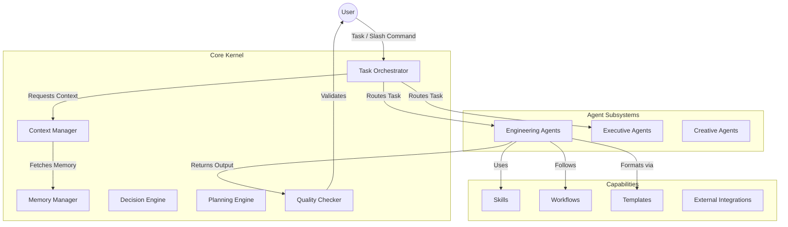

<div align="center">
  <h1>🌌 Thoth OS</h1>
  <p><strong>A Cognitive Architecture and Agentic Operating System for AI Workspaces</strong></p>
  <p><strong>🌐 Live Dashboard: <a href="https://thoth-os.vercel.app/">thoth-os.vercel.app</a></strong></p>
  <br />
</div>

## 📖 Overview

**Thoth OS** is a comprehensive, declarative operating system designed to structure, orchestrate, and optimize Large Language Model (LLM) behavior within an agentic workspace (like Antigravity). 

Unlike traditional software frameworks written in JavaScript or Python, Thoth OS is built entirely out of **markdown-based cognitive schemas**. It shapes the AI's persona, reasoning, decision-making, memory management, and multi-agent coordination. It turns a raw, unstructured LLM into a disciplined team of specialists—from Software Architects to QA Engineers and Startup CEOs.

## 🎯 Why Thoth OS Exists

Raw LLMs suffer from context loss, hallucination, generic reasoning, and lack of systemic memory over long sessions. Thoth OS solves this by introducing a **kernel-level cognitive architecture**:

* **Specialization over Generalization**: Tasks are routed to domain experts (e.g., `Frontend Engineer`, `Software Architect`) rather than handled by a generic assistant.
* **Deterministic Quality**: Global rules enforce strict architectural patterns, error handling, and security practices.
* **Context Budgeting**: The `Context Manager` prunes and prioritizes context to prevent token exhaustion and primacy bias.
* **Complex Orchestration**: The `Task Orchestrator` manages multi-agent pipelines (fan-out/fan-in) for complex tasks like building an MVP.

## 🧠 Core Architecture

Thoth OS operates as a layered architecture where natural language tasks are intercepted, structured, and routed through a defined execution pipeline.



## ⚙️ System Lifecycle & Execution Flow

When a developer interacts with Thoth OS, the system follows a strict lifecycle:

1. **Entry**: The user inputs a prompt or command (e.g., `/startup`).
2. **Orchestration**: The `Task Orchestrator` analyzes the intent and generates an execution plan.
3. **Context Assembly**: The `Context Manager` builds a context package, pruning irrelevant history and loading necessary project state.
4. **Execution**: The task is routed to the most qualified Agent (e.g., `Software Architect`).
5. **Decision & Skills**: The Agent uses the `Decision Engine` for trade-off analysis and applies specific `Skills`.
6. **Handoff**: For complex workflows, the output is passed to the next agent in the pipeline (e.g., Architect -> Backend Engineer).
7. **Quality Check**: The `Quality Checker` ensures the output adheres to the global `AGENTS.md` rules.
8. **Output**: The finalized, production-ready result is returned to the user.

## 🗂️ Repository Structure

Thoth OS uses a highly semantic folder structure to define its cognitive rules.

```text
thoth-os/
├── Agents/        # Specialized AI personas (Engineering, Executive, Startup, etc.)
├── Commands/      # Slash commands that trigger specific system behaviors (e.g., /help)
├── Core/          # The kernel modules (Context Manager, Task Orchestrator, etc.)
├── Docs/          # Internal system documentation and architecture guides
├── frontend/      # 🌐 The Capability Center UI (Interactive React Dashboard)
├── Knowledge/     # Curated domain knowledge and contextual baselines
├── MCP/           # Integrations with external tools and API providers
├── Projects/      # Active workspace projects managed by the OS
├── Rules/         # Global constraints (e.g., AGENTS.md for coding standards)
├── Skills/        # Reusable capabilities (e.g., design-engineering, architecture, debugging)
├── Templates/     # Markdown templates for structured outputs (PRDs, ADRs)
└── Workflows/     # Multi-agent execution pipelines (e.g., startup.md, bug-fix.md)
```

## 🌐 The Capability Center (Frontend)

Because Thoth OS operates invisibly via markdown configuration and LLM context, we have built the **Capability Center**—a highly polished, cinematic web interface located in the `frontend/` directory.

The Capability Center acts as the visual dashboard for the OS. It includes a build-time scraper that reads the raw Markdown files across the repository and visualizes them into an interactive UI. 

**Features Include:**
* **Interactive Architecture Graph**: See an isometric 3D mapping of the kernel, agents, and skills.
* **Skill Explorer**: Browse, filter, and inspect the capabilities of the system.
* **Execution Simulator**: Visually inspect the input/output schemas of how agents utilize specific skills.

To run the capability center locally:
```bash
cd frontend
yarn install
yarn dev
```
For full details on the frontend architecture, see [Docs/FRONTEND.md](Docs/FRONTEND.md).

## 🧩 Core Schema: The Module Definition

Everything in Thoth OS is defined via a structured Markdown schema. A standard Core Module or Agent uses the following schema:

| Section | Purpose | Example |
|---|---|---|
| **Frontmatter** | Defines identity, version, and status. | `> Module: Core`, `> Status: Active` |
| **Purpose/Role** | High-level objective of the component. | "The central dispatcher of Thoth OS." |
| **Responsibilities** | Bulleted list of exact capabilities. | "1. Task Routing, 2. Dependency Management" |
| **Invocation Rules** | Table of triggers and resulting actions. | `User submits task` → `Route to agent` |
| **Inputs/Outputs** | Expected data structures. | `conversation_history` (Array), `status` (Object) |
| **Decision Logic** | Markdown or Mermaid flowcharts. | Routing logic tree for task dispatch. |

## 🚀 Quick Start

Thoth OS is loaded automatically by the underlying agent workspace (such as the Antigravity IDE framework) reading from the `Rules` and `Agents` directories.

**To trigger a workflow:**
Simply type one of the core commands in your chat interface:

* `/startup` - Initializes the full startup workflow (Ideation → Solution Design → MVP Build).
* `/brag` - Analyzes your current project and generates a cinematic launch video using Hyperframes (see [Docs/brag.md](Docs/brag.md)).
* `/help` - Displays the system manual and available commands.

## 🧑‍💻 Public Interface & Usage

Because Thoth OS is a cognitive architecture rather than a traditional software binary, its "API" is exposed through Natural Language and Agent Triggers.

### 1. Direct Agent Invocation
You can directly address specialists to bypass the Task Orchestrator:
> *"@Software Architect: I need an architecture decision record for choosing between PostgreSQL and MongoDB for our new chat app."*

### 2. Workflow Pipelines
Trigger predefined pipelines defined in `/Workflows`:
> *"Run the bug-fix workflow on the authentication module."*

### 3. Global Rules Enforcement
The system implicitly runs `Rules/AGENTS.md` on every interaction. This guarantees:
- No placeholder code (`TODO`s).
- Mandatory Mermaid diagrams for architectural discussions.
- Explanations of trade-offs for every technical decision.

## 🛠️ Extending Thoth OS

Thoth OS is designed to be deeply extensible.

### Adding a New Agent
Create a new markdown file in `Agents/<Domain>/<agent-name>.md`.
1. Define the **Role** and **Expertise**.
2. Specify **Trigger Conditions**.
3. Define **Output Formats** and **Collaboration Rules**.

### Adding a New Skill
Create a directory in `Skills/<Domain>/<skill-name>/` containing a `SKILL.md`. The `Task Orchestrator` will automatically make this skill available to relevant agents.

## ⚠️ Known Limitations
* **Implicit State**: As a prompt-based OS, state is maintained in the LLM's context window. Highly complex pipelines require careful context pruning by the `Context Manager` to avoid token limit exhaustion.
* **Asynchronous Handoffs**: True parallel multi-agent execution depends on the underlying runtime's ability to spawn concurrent sub-agents.
* **Self-Modification**: The OS cannot safely modify its own core modules dynamically without manual developer review to prevent cognitive degradation.

## 📜 License
*Thoth OS is an internal system architecture configuration. See individual repository licenses for distribution terms.*
