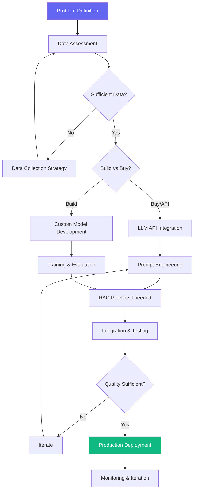

# AI Product Workflow

> **Version**: 1.0.0  
> **Trigger**: `/ai` command or AI product development

---

## Overview

End-to-end workflow for building AI-powered products — from problem definition through data preparation, model selection, evaluation, integration, and deployment.

---

## Flow Diagram

---

## Phases

### Phase 1: Problem & Data
**Agents**: AI Engineer, Chief Research Officer  
**Skills**: Context Engineering, Embeddings

| Step | Deliverable |
|---|---|
| Define AI use case | Problem statement with success metrics |
| Assess available data | Data inventory and quality report |
| Evaluate build vs buy | Decision with cost analysis |

### Phase 2: Build
**Agents**: AI Engineer, ML Engineer  
**Skills**: Prompt Engineering, RAG, Fine-Tuning, Agent Design

| Step | Deliverable |
|---|---|
| Design AI pipeline | Architecture diagram |
| Implement core AI logic | Working prototype |
| Build evaluation framework | Eval dataset + metrics |

### Phase 3: Integrate & Deploy
**Agents**: Backend Engineer, DevOps Engineer, Security Engineer  
**Skills**: API Security, Docker, Monitoring

| Step | Deliverable |
|---|---|
| API integration | Production API endpoint |
| Security review | AI security audit |
| Deploy and monitor | Production deployment with dashboards |

---

## Decision Points

1. **Build vs Buy**: Can an API (OpenAI, Anthropic) solve this, or do you need custom models?
2. **RAG vs Fine-Tuning**: Does the model need external knowledge (RAG) or behavioral change (fine-tuning)?
3. **Quality Gate**: Is the AI output quality sufficient for production use?

---

## Success Criteria

- [ ] AI feature delivers measurable user value
- [ ] Output quality exceeds defined threshold
- [ ] Cost per query within budget
- [ ] Latency meets user expectations
- [ ] Guardrails prevent harmful outputs

---

## Automation Opportunities

| Process | Tool |
|---|---|
| Eval pipeline | LangSmith, Braintrust |
| Prompt versioning | PromptLayer, custom |
| Cost tracking | OpenAI usage API, LiteLLM |
| Quality monitoring | Custom eval dashboards |
