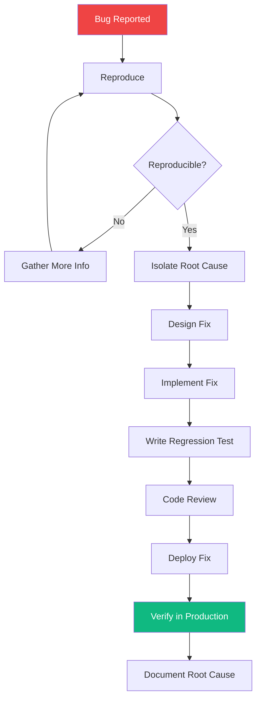

# Bug Fix Workflow

> **Version**: 1.0.0  
> **Trigger**: `/debug` command

---

## Flow Diagram

## Steps

| Step | Agent | Deliverable | Max Time |
|---|---|---|---|
| Reproduce | QA Engineer | Reproduction steps | 30 min |
| Isolate | Principal Engineer | Root cause analysis | 2 hours |
| Fix | Domain Engineer | Bug fix + regression test | 4 hours |
| Review | Peer Engineer | Approved PR | 1 hour |
| Deploy | DevOps Engineer | Production deployment | 30 min |
| Verify | QA Engineer | Production verification | 30 min |
| Document | Domain Engineer | Post-mortem (if P0/P1) | 30 min |

## Decision Points
1. **Severity Assessment**: P0 (drop everything) vs P1 (next sprint) vs P2 (backlog)
2. **Fix vs Workaround**: Quick fix now + proper fix later, or proper fix now?
3. **Rollback Decision**: If fix introduces new issues, rollback immediately

## Success Criteria
- [ ] Bug is no longer reproducible
- [ ] Regression test prevents recurrence
- [ ] No new bugs introduced by the fix
- [ ] Root cause documented for learning
