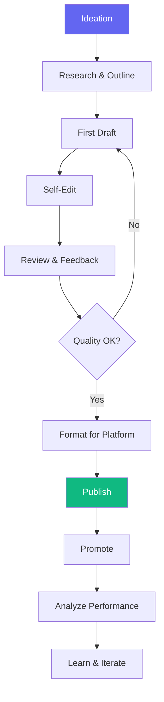

# Content Creation Workflow

> **Version**: 1.0.0  
> **Trigger**: `/content` command

---

## Flow Diagram

## Content Types & Agents

| Content Type | Primary Agent | Skills |
|---|---|---|
| Blog post | Script Writer | Blog Writing, SEO |
| LinkedIn post | Marketing Strategist | LinkedIn |
| YouTube video | Script Writer + Director | YouTube Scripts, Storyboarding |
| Technical doc | Backend/Frontend Engineer | Technical Documentation |
| Presentation | UI Designer | Presentation Design |

## Success Criteria
- [ ] Content delivers value to target audience
- [ ] SEO-optimized (for searchable content)
- [ ] Platform-specific formatting applied
- [ ] CTA included
- [ ] Performance tracked and analyzed
