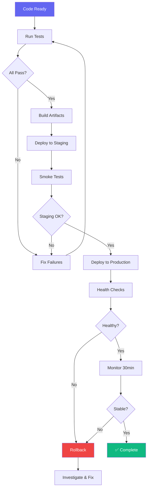

# Deployment Workflow

> **Version**: 1.0.0  
> **Trigger**: `/deploy` command

---

## Flow Diagram

## Pre-Deployment Checklist
- [ ] All tests passing (unit, integration, E2E)
- [ ] Code review approved
- [ ] Security scan clean
- [ ] Database migrations tested
- [ ] Environment variables configured
- [ ] Rollback plan documented
- [ ] Monitoring alerts configured

## Deployment Strategy Options
| Strategy | Risk | Downtime | Complexity | Best For |
|---|---|---|---|---|
| Blue-Green | Low | Zero | Medium | Most deployments |
| Canary | Very Low | Zero | High | High-traffic services |
| Rolling | Low | Zero | Medium | Kubernetes deployments |
| Recreate | High | Yes | Low | Dev/staging only |

## Success Criteria
- [ ] Zero downtime during deployment
- [ ] Health checks passing within 2 minutes
- [ ] No error rate increase after deployment
- [ ] Rollback successful within 5 minutes (if needed)
