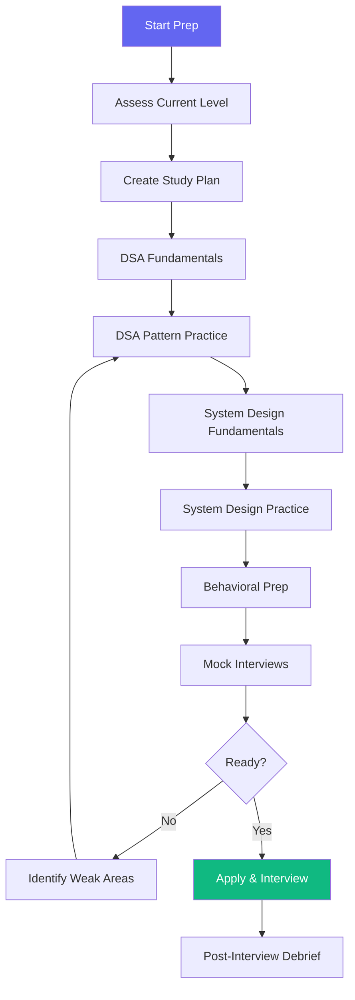

# Google Interview Preparation Workflow

> **Version**: 1.0.0  
> **Trigger**: `/google` command

---

## Flow Diagram

## Study Plan (12-Week Program)

| Week | DSA Focus | System Design | Behavioral |
|---|---|---|---|
| 1-2 | Arrays, Strings, Hash Maps | -- | Start STAR stories |
| 3-4 | Linked Lists, Stacks, Queues | URL Shortener | Refine stories |
| 5-6 | Trees, BST, Graphs | News Feed, Chat System | Practice delivery |
| 7-8 | BFS/DFS, Backtracking | Rate Limiter, Key-Value Store | Mock behavioral |
| 9-10 | Dynamic Programming | YouTube, Google Drive | Full mocks |
| 11-12 | Review weak areas, contests | Custom designs | Final mocks |

## Daily Practice Schedule
| Time | Activity | Duration |
|---|---|---|
| Morning | 2 LeetCode problems (1 medium, 1 hard) | 90 min |
| Afternoon | System design study/practice | 60 min |
| Evening | Review solutions, flashcards | 30 min |

## Success Criteria
- [ ] Solve medium LeetCode in <25 min consistently
- [ ] Solve hard LeetCode in <45 min with hints acceptable
- [ ] Design 10+ systems end-to-end with confidence
- [ ] 5+ polished STAR behavioral stories
- [ ] 3+ full mock interviews completed

## Automation Opportunities
| Process | Tool |
|---|---|
| Problem tracking | LeetCode, NeetCode |
| Spaced repetition | Anki flashcards |
| Mock interviews | Pramp, interviewing.io |
