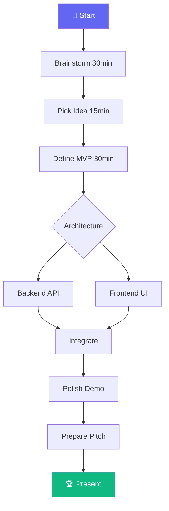

# Hackathon Workflow

> **Version**: 1.0.0  
> **Trigger**: `/hackathon` command

---

## Overview

A time-optimized workflow for hackathons (24-48 hours). Maximizes impact by front-loading decisions, parallelizing work, and focusing relentlessly on a demo-able product.

---

## Flow Diagram

---

## Timeline (24-hour hackathon)

| Hour | Phase | Activity | Deliverable |
|---|---|---|---|
| 0-0.5 | Ideation | Brainstorm 3-5 ideas | Idea shortlist |
| 0.5-1 | Selection | Pick idea, define MVP | One-page spec |
| 1-2 | Architecture | Tech stack, API design, UI sketch | Architecture decision |
| 2-8 | **Build** | Core features (backend + frontend parallel) | Working prototype |
| 8-10 | Integration | Connect frontend to backend, fix bugs | Integrated app |
| 10-12 | Polish | UI polish, demo flow, error handling | Demo-ready product |
| 12-14 | Demo Prep | Pitch script, slides, rehearsal | Pitch deck + script |
| 14 | **Present** | Demo and pitch | 🏆 |

---

## Decision Points

1. **Idea Selection** (Hour 0.5): Pick the idea that is most demo-able, not most ambitious.
2. **Scope Cut** (Hour 6): If behind schedule, cut features ruthlessly. One polished feature > three broken ones.
3. **Polish vs Features** (Hour 10): Stop adding features. Start polishing what exists.

---

## Success Criteria

- [ ] Working demo with one impressive feature
- [ ] Clear, rehearsed pitch (2-3 minutes)
- [ ] No crashes during demo
- [ ] Audience understands the problem and solution in 30 seconds

---

## Hackathon Rules of Thumb

1. **Demo > Code** — A beautiful demo with hacky code beats beautiful code with no demo.
2. **One "wow" moment** — Every winning hack has ONE moment that makes judges say "wow."
3. **Fake what you can** — Hardcode data, mock APIs, use pre-built templates. Ship the demo, not the production system.
4. **Start with the pitch** — Know what you'll say before you know what you'll build.

---

## Automation Opportunities

| Process | Tool |
|---|---|
| Project scaffolding | Vite / Next.js templates |
| UI components | shadcn/ui, DaisyUI |
| Backend API | Supabase / Firebase for instant backend |
| Deployment | Vercel for instant deploy |
| Pitch slides | Markdown to slides tool |
