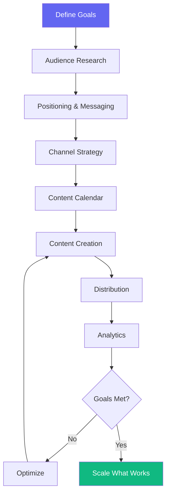

# Marketing Workflow

> **Version**: 1.0.0  
> **Trigger**: `/marketing` command

---

## Flow Diagram

## Phases

### Phase 1: Strategy
**Agents**: Marketing Strategist, CEO | **Skills**: Competitive Analysis, Go-To-Market
- Define objectives → Research audience → Create positioning → Select channels

### Phase 2: Execution
**Agents**: Script Writer, UI Designer | **Skills**: LinkedIn, Blog Writing, SEO, YouTube Scripts
- Build content calendar → Create content → Schedule distribution → Engage

### Phase 3: Optimization
**Agents**: Growth Lead | **Skills**: SEO, Analytics
- Track metrics → Analyze performance → Double down on winners → Cut losers

## Success Criteria
- [ ] Brand positioning clearly defined
- [ ] Content calendar maintained for 4+ weeks
- [ ] Engagement metrics improving week-over-week
- [ ] Leads/signups attributed to marketing channels

## Automation Opportunities
| Process | Tool |
|---|---|
| Social scheduling | Buffer, Hootsuite |
| Email campaigns | ConvertKit, Resend |
| Analytics | Google Analytics, PostHog |
| Content repurposing | AI-assisted reformatting |
