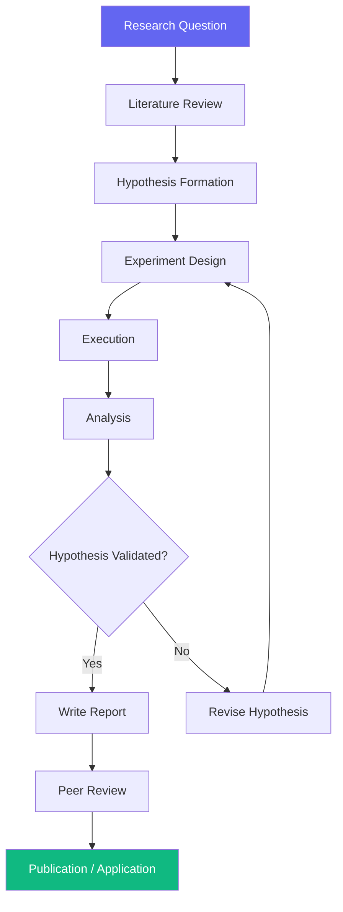

# Research Workflow

> **Version**: 1.0.0  
> **Trigger**: `/research` command

---

## Flow Diagram

## Phases

### Phase 1: Discovery
**Agents**: Chief Research Officer | **Skills**: Literature Review, Paper Review
- Define research question → Literature survey → Identify gaps → Form hypothesis

### Phase 2: Investigation
**Agents**: ML Engineer, AI Engineer | **Skills**: Experiment Design, Benchmarking
- Design experiment → Execute → Collect data → Analyze results

### Phase 3: Communication
**Agents**: Chief Research Officer | **Skills**: Technical Writing
- Write report → Internal review → Publish or apply findings

## Success Criteria
- [ ] Research question is clearly scoped and falsifiable
- [ ] Literature review covers state-of-the-art
- [ ] Experiment is reproducible
- [ ] Findings are statistically significant
- [ ] Report is clear and actionable

## Automation Opportunities
| Process | Tool |
|---|---|
| Paper discovery | Semantic Scholar API, arXiv |
| Experiment tracking | MLflow, Weights & Biases |
| Citation management | Zotero, BibTeX |
