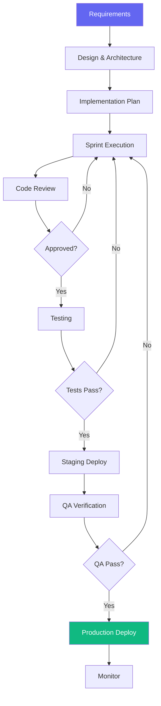

# Software Development Workflow

> **Version**: 1.0.0  
> **Trigger**: `/build` command

---

## Flow Diagram

## Phases

### Phase 1: Requirements & Design
**Agents**: Product Manager, Software Architect, CTO
- Write PRD → Design architecture → Define API contracts → Create sprint plan

### Phase 2: Implementation
**Agents**: Backend Engineer, Frontend Engineer, Flutter Engineer
- Set up project → Implement features → Write tests → Code review

### Phase 3: Quality & Deploy
**Agents**: QA Engineer, Security Engineer, DevOps Engineer
- Run test suite → Security review → Stage → Deploy → Monitor

## Success Criteria
- [ ] All acceptance criteria met
- [ ] Test coverage >80% on core modules
- [ ] No critical or high severity bugs
- [ ] Security review passed
- [ ] Performance within acceptable limits
- [ ] Documentation updated

## Automation Opportunities
| Process | Tool |
|---|---|
| CI/CD | GitHub Actions |
| Code review | Automated linting + PR reviews |
| Testing | Automated test suite in CI |
| Deployment | Automated deploy pipeline |
| Monitoring | Automated alerting |
