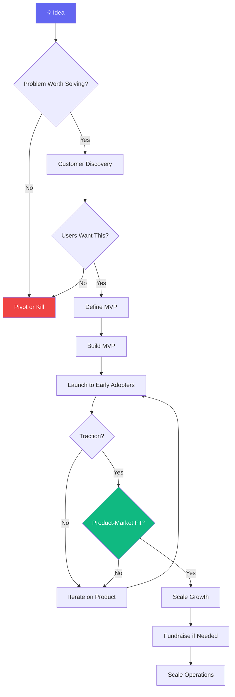

# Startup Workflow

> **Version**: 1.0.0  
> **Trigger**: `/startup` command or new venture initialization

---

## Overview

A comprehensive workflow for taking a startup idea from initial concept through validation, MVP, launch, and growth. Each phase has clear deliverables, decision gates, and success criteria.

---

## Flow Diagram

---

## Phases

### Phase 1: Ideation & Validation (Week 1-2)

**Agents**: CEO, Customer Discovery Expert, YC Advisor  
**Skills**: Competitive Analysis, Business Models  
**Templates**: Business Model Canvas, PRD

| Step | Action | Deliverable |
|---|---|---|
| 1.1 | Define the problem clearly | Problem Statement (1 paragraph) |
| 1.2 | Identify target customers | 3 User Personas |
| 1.3 | Conduct 10+ user interviews | Interview Synthesis Report |
| 1.4 | Analyze competitors | Competitive Analysis Matrix |
| 1.5 | Validate problem severity | Evidence-based validation doc |

**Decision Gate**: Is the problem real, frequent, and painful enough to build for?

### Phase 2: Solution Design (Week 2-3)

**Agents**: CPO, Software Architect, UI Designer  
**Skills**: PRD Writing, System Design, Architecture  
**Templates**: PRD, Architecture Document

| Step | Action | Deliverable |
|---|---|---|
| 2.1 | Define MVP scope (must-haves only) | MVP PRD |
| 2.2 | Design system architecture | Architecture Document |
| 2.3 | Create UI wireframes | Wireframe designs |
| 2.4 | Define tech stack | Tech stack ADR |
| 2.5 | Estimate timeline | Sprint Plan |

**Decision Gate**: Can we build this MVP in 2-4 weeks?

### Phase 3: Build MVP (Week 3-6)

**Agents**: Backend Engineer, Frontend Engineer, DevOps Engineer  
**Skills**: React/Next.js, Node.js/FastAPI, PostgreSQL, Docker  
**Templates**: Sprint Plan, API Specification

| Step | Action | Deliverable |
|---|---|---|
| 3.1 | Set up project infrastructure | Repo, CI/CD, staging |
| 3.2 | Build core backend API | Working API endpoints |
| 3.3 | Build core frontend | Working UI |
| 3.4 | Integrate and test | Integrated MVP |
| 3.5 | Deploy to production | Live URL |

### Phase 4: Launch & Iterate (Week 6-10)

**Agents**: Growth Lead, Marketing Strategist, QA Engineer  
**Skills**: Go-To-Market, SEO, LinkedIn, Analytics  
**Templates**: Meeting Notes, Weekly Review

| Step | Action | Deliverable |
|---|---|---|
| 4.1 | Soft launch to 10-50 early adopters | User feedback |
| 4.2 | Set up analytics and monitoring | Dashboard |
| 4.3 | Iterate based on feedback | Updated product |
| 4.4 | Public launch | Launch campaign |
| 4.5 | Track growth metrics | Weekly growth report |

### Phase 5: Growth & Scale (Week 10+)

**Agents**: CEO, Growth Lead, Fundraising Advisor  
**Skills**: Business Models, Pitch Decks, Feature Prioritization

| Step | Action | Deliverable |
|---|---|---|
| 5.1 | Achieve consistent weekly growth | Growth metrics |
| 5.2 | Evaluate fundraising readiness | Fundraising strategy |
| 5.3 | Build pitch deck | Investor pitch deck |
| 5.4 | Scale team and operations | Operational plan |

---

## Success Criteria

- [ ] Problem validated with 10+ user interviews
- [ ] MVP launched within 4 weeks
- [ ] 100+ users in first month
- [ ] 5-7% weekly growth rate
- [ ] Positive unit economics identified

---

## Automation Opportunities

| Process | Automation | Tool |
|---|---|---|
| User interview scheduling | Calendar integration | Google Calendar MCP |
| Deployment | CI/CD pipeline | GitHub Actions |
| Analytics tracking | Automated dashboards | PostHog / Mixpanel |
| User feedback collection | In-app feedback widget | Custom or Canny |
| Weekly metrics report | Automated report generation | n8n / Zapier |
